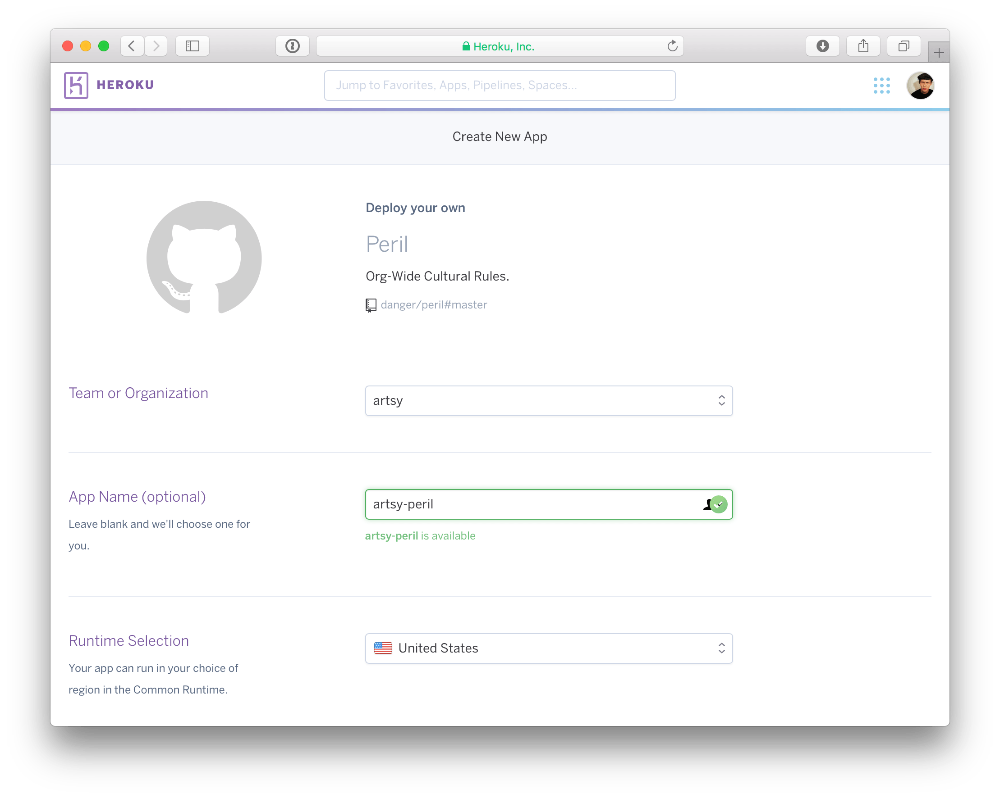
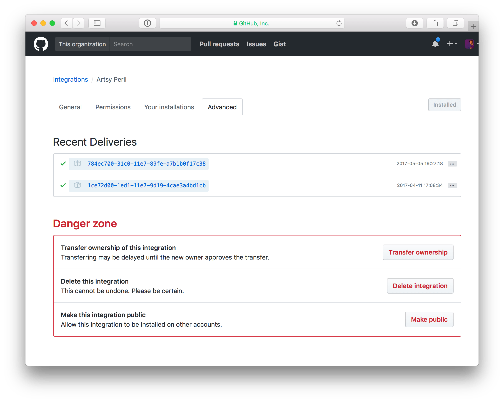

### Setting up a Peril server

I'm assuming you're going to use heroku. Peril is set up for being used in Docker, but it'll require a bit of time before _I'm_ confident using it myself, and thus writing tutorials for it.

> Sidenote: here's a note with [terminology](./terminology.md) as it's a little tricky.

So, you will need to have:

* A unique GitHub Integration
* A repo where you can keep Peril settings
* A heroku instance for Peril

## Creating your integration

You would go to the URL (with your org): 

> https://github.com/organizations/[my_org]/settings/integrations

Then create a new integration (use `peril-[my-org]`, there is a global namespace.) At the bottom is the option to only allow this integration to run on your org, you want this ticked probably.

Once this is created, you need to install the integration on your GitHub org. [explain process for this]. Also download the integration github signing key and keep track of the integration ID, you'll need this later.

You can do the same thing on your user account too BTW.

## Repo Settings

You need to have a repo which Peril has access to. This repo needs to have a settings JSON file. For now, let's use some example Dangerfiles:

```json
{
  "settings": {
    "onlyForOrgMembers": false
  },
  "rules": {
    "pull_request": "orta/peril-bootstrap@pr.ts",
    "issue": "orta/example-peril@issue.ts"
  },
  "repos" : {
    "orta/ORStackView": {
      "issue.created": "lock_old_issues.ts"
    }
  }
}
```

You can look at the both the [pull_request](https://github.com/orta/peril-bootstrap/blob/master/pr.ts) and [issue](https://github.com/orta/peril-bootstrap/blob/master/issue.ts), to verify there are no [shenanigans](https://www.merriam-webster.com/dictionary/shenanigan). 

This JSON file is split into 3 parts:

* Settings for Peril
* Rules for the organization 
* Rules per repo

This setup will:

* Listen for the event `"pull_request"`, and will pull  `"pr.ts"` from the repo: `orta/peril-bootstrap`.
* Listen for the event `"issue"`, and will pull  `"issue.ts"` from the repo: `orta/peril-bootstrap`.
* Listen for the event `"issue"` event, and only if the action is `"created"` and will pull `"lock_old_issues.ts"` from the same repo: `orta/ORStackView`. So it would ignore issue updates or deletes.

You can actually use `orta/example-peril` BTW, I have some dummy Dangerfiles on that repo exactly for this purpose. Save the above JSON as `peril-settings.json`. Add that to a repo, push it to master on your GitHub remote. Here's one [I did earlier](https://github.com/artsy/artsy-danger/commit/03a1745b1f9f83fc2367ed6cdc72dee3f466b75f).

Note: when you make updates to this file, you need to restart your Peril server.

## Heroku

Ok, so, you need a heroku account. So sign up if you've not. This post will wait for you.

Click: [](https://heroku.com/deploy?template=https://github.com/danger/peril)
 . It's the "auto-heroku-ize" button that will walk you through setting up the environment variables for running Danger for just one org.

It should take you to a page like this:



You need to go through adding the environment variables. The `app.json` is self-documenting about the variables that need to be set.

# Hooking the integration to your repo

Go to:  https://[your-heroku-app].herokuapp.com/ - it should show a really simple "Hello world" page. That means the server launched.

Back to your integration settings. You can skip the "Setup URL", but you need to set your "Webhook URL". This is the heroku URL for the webhook, it is `https://[your-heroku-app].herokuapp.com/webhook`

Save your changes. Now you need to install the integration into your repo. Go to the "Your installations" tab inside the Integration. Hit "Install"

Go through either adding it to the org, or adding each repo you want. Then go back to your integration, if you go to "Advanced" on the top you can see the list of events that got sent to your Peril instance. Hopefully it looks like this:



This 

# Prove it works

If you open a PR on any repo, Peril should comment on your PR. 


If it doesn't, run `heroku logs --app [my_heroku_peril_app]` and see if I missed something obvious.

